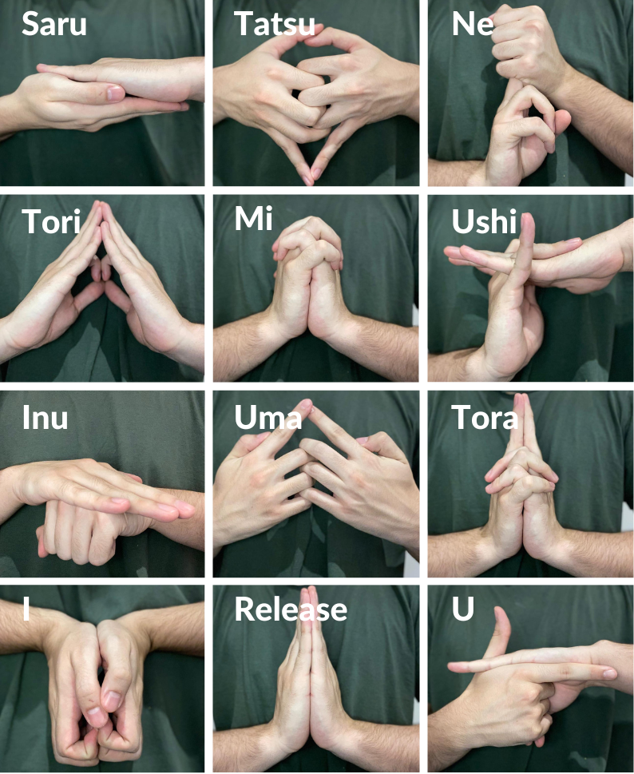

# Hand Gesture Recognition with TensorFlow.js, Teachable Machine, and MediaPipe
This project is a real-time hand gesture recognition system that identifies and classifies nine distinct hand gestures. It utilizes TensorFlow.js for implementing machine learning in JavaScript, Teachable Machine for training the recognition model, and MediaPipe for hand detection in the input frames. The gestures and their associated actions are inspired by the anime "Naruto".

# System Architecture
The architecture of this project consists of two major components:

1. **Hand Detection**: Mediapipe is used to detect hand landmarks in the input frames. The landmarks are then used to crop the image and isolate the hand from the background.
2. **Gesture Recognition**: Once the hand is detected and the image cropped, it's then fed to a machine learning model trained via Teachable Machine. This model classifies the gesture into one of the nine categories.

# Demo
https://user-images.githubusercontent.com/101474762/221086680-e21feaae-ec04-4f11-83ef-4acb06119c54.mp4

# Getting Started
You can try the live demo of the app [here](https://ben-tiki.github.io/naruto-handseal-recognition/) or clone this repository and open the `index.html` file in your browser. In `assets/jutsus.json`, you can see or edit the combinations of each jutsu.

# Dataset Information
The project is trained on a custom dataset, created by the author, which includes 9 different classes of hand gestures. Each class is represented by 500 images captured via a webcam under varying conditions of lighting, individual hand shapes, and backgrounds.

### Limitations of the dataset:
The model's performance may vary with new data due to the limitations of the current dataset. Improvements can be achieved by increasing the dataset size and diversity of the images.

# Model 
The model can be found in the `assets/model` folder. 

# Gesture Reference

  

The nine hand gestures used in this project are inspired by the anime "Naruto". In the series, characters perform these seals to use their special abilities or "jutsu". Each gesture has a unique meaning in the context of the anime.

# Tech Stack
- [TensorFlow.js](https://www.tensorflow.org/js) - A JavaScript library for training and deploying machine learning models in the browser and on Node.js

- [Teachable Machine](https://teachablemachine.withgoogle.com/) - A web tool for training and deploying machine learning models in the browser.

- [Mediapipe](https://developers.google.com/mediapipe) - A cross-platform framework for building multimodal applied machine learning pipelines.